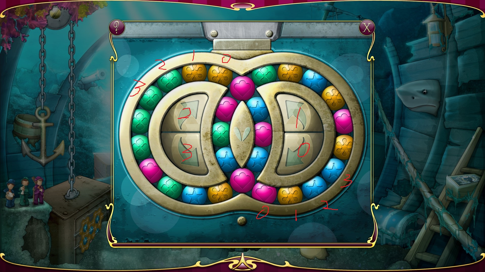
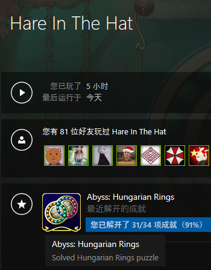

# 匈牙利环



http://store.steampowered.com/app/460890/Hare_In_The_Hat_The_Abyss/  
被这个游戏的匈牙利环困扰许久

人脑不能解决，那就尝试用计算机解决  

# 建模方法
由图可知，这个匈牙利环分为左右两个环，每个环拥有15个珠子，每个珠子有四种颜色的可能性，四种颜色可以用两个bit表示。  
同时，对于环的操作有四种：左环顺时针旋转，左环逆时针旋转，右环顺时针旋转，右环逆时针旋转。  
因此，可以考虑用两个32位整型数据来表示两个环的形态。旋转操作可以用位操作表示。  

然而，由于这个匈牙利环总共有28个珠子，因此可能的排列组合有C(28,7)*C(21,7)*C(14,7)*C(7,7)种，即存在472,518,347,558,400种可能。  
BFS内存爆炸，DFS栈溢出
因此需要使用启发式搜索算法
  
# A*算法
用树来表示搜索算法的话，深度优先搜索会尽可能拓展当前路径的深度，广度优先搜索会尽可能拓展树的宽度。  
而A* 算法，本质上是用一个估计函数，来评价一个节点有多高的可能性获得目标解，并将其存储。然后将待搜索节点按照其评价函数排序，优先搜索评价高的节点。因此能够得知，A* 算法能够比广度优先搜索拥有更低的空间复杂度，又比深度优先搜索拥有更高的时间稳定性。  


游戏运行前如下图  
  

使用简单的估值函数  

```
int estimate() {
				int res = 0, T = 0;
				std::array<int, 4>color1,color2;
				for (int T = 0; T < 2;++T) {
					color1.fill(0);
					color2.fill(0);
					for (int i = T * 7; i < T * 7 + 7; ++i) {
						color1[int(getColor("left", i))]++;
						color2[int(getColor("right", i))]++;
					}
					res += *std::max_element(begin(color1), end(color1)) + *std::max_element(begin(color2), end(color2));
				}
				return res;
			}
			bool operator()(const HungarianRingsEx &a, const HungarianRingsEx &b) {
				return a.estimateVal < b.estimateVal || (a.estimateVal == b.estimateVal && a.times > b.times);
			}
```


代码运行结果：

>finish
4 0 2 0 0 3 3 3 3 3 1 2 0 3 1 2 2 0 3 1 2 0 2 1 2 1 2 1 2 2 2 1 3 3 3 0 3 1 2 2 0 3 1 2 2 2 2 2 2 0 0 3 3 3 3 1 3 0 2 2 2 2 1 3 3 3 0 2 2 1 2 2 0 3 3 3 3 1 2 2 0 3 3 1 3 0 2 1 3 0 2 2 2 1 2 0 3 1 3 3 3 3 0 2 2 2 2 1 3 0 2 1 3 3 3 0 2 2 1 3 0 3 1 2 2 0 3 1 2 0 0 0 3 1 1 2 1 1 3 0 2 1 3 0 2 0 3 0 0 2 1 3 1 2 0 3 0 0 0 0 0 3 3 0 2 2 1 3 0 3 1 2 0 2 1 3 0 2
it takes 113.708 second

A* 算法的效果立竿见影！


# 自动化游戏
上面用A* 算法计算出解后，解的步骤有点长，对照着解进行操作，难免会发生意外（QAQ）。因此，最好是能够自动化的进行游戏。模拟鼠标操作，依据过往的经验，我会采用按键精灵，或者AHK（AutoHotKey）。然而最近刚好在学习Python，于是就朝这个方向进行相关查询，找到了一个不错的库：PyMouse。

相关代码如下：
```
from pymouse import PyMouse
import time
L=1175,600
AL=1175,450
R=750,450
AR=750,600
ops={0:L,1:AL,2:R,3:AR}
m = PyMouse()
input=[0,2,0,0,3,3,3,3,3,1,2,0,3,1,2,2,0,3,1,2,0,2,1,2,1,2,1,2,2,2,1,3,3,3,0,3,1,2,2,0,3,1,2,2,2,2,2,2,0,0,3,3,3,3,1,3,0,2,2,2,2,1,3,3,3,0,2,2,1,2,2,0,3,3,3,3,1,2,2,0,3,3,1,3,0,2,1,3,0,2,2,2,1,2,0,3,1,3,3,3,3,0,2,2,2,2,1,3,0,2,1,3,3,3,0,2,2,1,3,0,3,1,2,2,0,3,1,2,0,0,0,3,1,1,2,1,1,3,0,2,1,3,0,2,0,3,0,0,2,1,3,1,2,0,3,0,0,0,0,0,3,3,0,2,2,1,3,0,3,1,2,0,2,1,3,0,2]
time.sleep(10)
for i in input:
    x,y=ops[i]
    m.move(x,y)
    time.sleep(1)
    m.click(x,y)
    time.sleep(1)
```
接下去就倒杯水，美滋滋地等待就好了

# 最后




成就拿到手！剩下的关卡就靠自己的脑子啦！