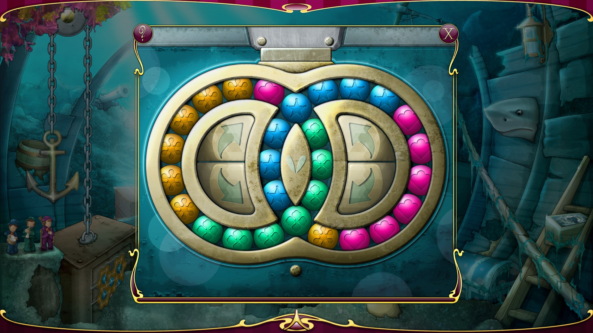

#匈牙利环

http://store.steampowered.com/app/460890/Hare_In_The_Hat_The_Abyss/
被这个游戏的匈牙利环困扰许久
人脑不能解决，那就用计算机解决吧

然而，由于这个匈牙利环总共有28个珠子，因此可能的排列组合有C(28,7)*C(21,7)*C(14,7)*C(7,7)种，即存在472,518,347,558,400种可能。
BFS内存爆炸

#待续